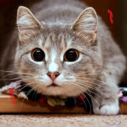
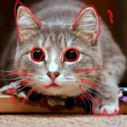
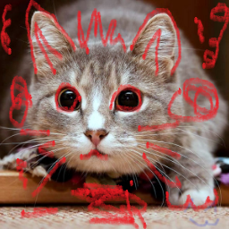

# Zefirrat.ImageComparer
Recognition of similar or same images, with varying degrees of accuracy.  
For example, for images with noise, the similarity of compressed images and the original ones, to search for the original image by its compressed copy, to search for images with small changes or distortions.

# Test demonstrations

## First image for compare (source):


## Comparing with compressed:
|Original|Compressed|
|-|-|
|||

### Result:
```sh
Accuracy: VeryLow
    Similar: True ✔      
    Equal: True ✔        
-------------------------
Accuracy: Low
    Similar: True ✔      
    Equal: False ✖       
-------------------------
Accuracy: Medium
    Similar: True ✔      
    Equal: False ✖       
-------------------------
Accuracy: High
    Similar: True ✔      
    Equal: False ✖       
-------------------------
Accuracy: VeryHigh       
    Similar: False ✖
    Equal: False ✖
-------------------------
```

## Added transparent drawing at right bottom corner:
|Original|With light drawing|
|-|-|
|||

### Result:
```sh
Accuracy: VeryLow
    Similar: True ✔      
    Equal: False ✖       
-------------------------
Accuracy: Low
    Similar: True ✔      
    Equal: False ✖       
-------------------------
Accuracy: Medium
    Similar: True ✔      
    Equal: False ✖       
-------------------------
Accuracy: High
    Similar: True ✔      
    Equal: False ✖       
-------------------------
Accuracy: VeryHigh
    Similar: False ✖
    Equal: False ✖
-------------------------
```

## Added few red curves:
|Original|With red curves|
|-|-|
|||

### Result:
```sh
Accuracy: VeryLow
    Similar: True ✔      
    Equal: False ✖       
-------------------------
Accuracy: Low
    Similar: True ✔      
    Equal: False ✖       
-------------------------
Accuracy: Medium
    Similar: True ✔      
    Equal: False ✖       
-------------------------
Accuracy: High
    Similar: True ✔      
    Equal: False ✖       
-------------------------
Accuracy: VeryHigh
    Similar: False ✖
    Equal: False ✖
-------------------------
```

## Added more red curves:
|Original|With red curves|
|-|-|
|||

### Result:
```sh
Accuracy: VeryLow
    Similar: True ✔      
    Equal: False ✖       
-------------------------
Accuracy: Low
    Similar: True ✔      
    Equal: False ✖       
-------------------------
Accuracy: Medium
    Similar: True ✔      
    Equal: False ✖       
-------------------------
Accuracy: High
    Similar: False ✖     
    Equal: False ✖       
-------------------------
Accuracy: VeryHigh       
    Similar: False ✖
    Equal: False ✖
-------------------------
```

## Added much more red curves:
|Original|Painted|
|-|-|
|||

### Result:
```sh
Accuracy: VeryLow
    Similar: True ✔      
    Equal: False ✖       
-------------------------
Accuracy: Low
    Similar: False ✖     
    Equal: False ✖       
-------------------------
Accuracy: Medium
    Similar: False ✖     
    Equal: False ✖       
-------------------------
Accuracy: High
    Similar: False ✖     
    Equal: False ✖       
-------------------------
Accuracy: VeryHigh
    Similar: False ✖
    Equal: False ✖
-------------------------
```


# Installation

## Package manager
```powershell
PM > Install-Package Zefirrat.ImageComparer
```
## Nuget
[Nuget package Zefirrat.ImageComparer](https://www.nuget.org/packages/Zefirrat.ImageComparer/)  
[Nuget package Zefirrat.ImageComparer.Abstractions](https://www.nuget.org/packages/Zefirrat.ImageComparer.Abstractions/)  
[Nuget package Zefirrat.ImageComparer.AspNet.Di](https://www.nuget.org/packages/Zefirrat.ImageComparer.AspNet.Di/)  


# Usage
## Base
```csharp
    var imageComparer = new ImageComparer();

    using var image1 = Image.Load("../../../../Test_Images/test_image_source.png");
    using var image2 = Image.Load("../../../../Test_Images/test_image_source_compressed.jpg");

    var similar = imageComparer.AreSimilar(image1, image2);
    var equal = imageComparer.AreEqual(image1, image2);
```

## Overloads


- Image (from [SixLabors.ImageSharp](https://www.nuget.org/packages/SixLabors.ImageSharp))
- Stream (format does not matter)
- byte array (format does not matter)
- string (path to file)

## Accuracy options
A higher value means a higher acceptable spread.

```csharp
public cllass ImageComparer
{
    // ...
        public static class AccuracyValues
        {
            public const byte VeryHigh = 1;
            public const byte High = 20;
            public const byte Medium = 50;
            public const byte Low = 90;
            public const byte VeryLow = byte.MaxValue;
        }
}
```

```csharp
    var imageComparer = new ImageComparer(ImageComparerOptions.AccuracyValues.VeryHigh);
```

## Dependency Injection
In `Configure`:
```csharp
    serviceCollection.AddImageComparer
```

And then request as interface:
```csharp
public YourControllerConstructor(IImageComparer imageComparer)
{
    _imageComparer = imageComparer;
}
```

# Explanation:
Inspired by the work on the "Manhattan distance" algorithm, which was based on calculating the distance between similar pixels, and based on this value, the probability of similarity of images was compared by the mean square deviation (standard deviation).

I took from this approach, the work with the mean square deviation (standard deviation).

**Prepare**:
- To begin with, all images are resized to 16x16.
- Then we take the rgba pixel values as coordinate values
- Convert pixels to vectors
- We take the lengths of the vectors
- We get an array of vector lengths for each image being compared

**For equality**:
- Comparison of the vector difference of each pixel with an acceptable discrepancy

**For similarity**:
- Getting the quadratic deviation (standard deviation) between the vectors for each image, and the sum of all vectors
- The difference between the total deviation and the deviation for each image should not exceed the allowable discrepancy
